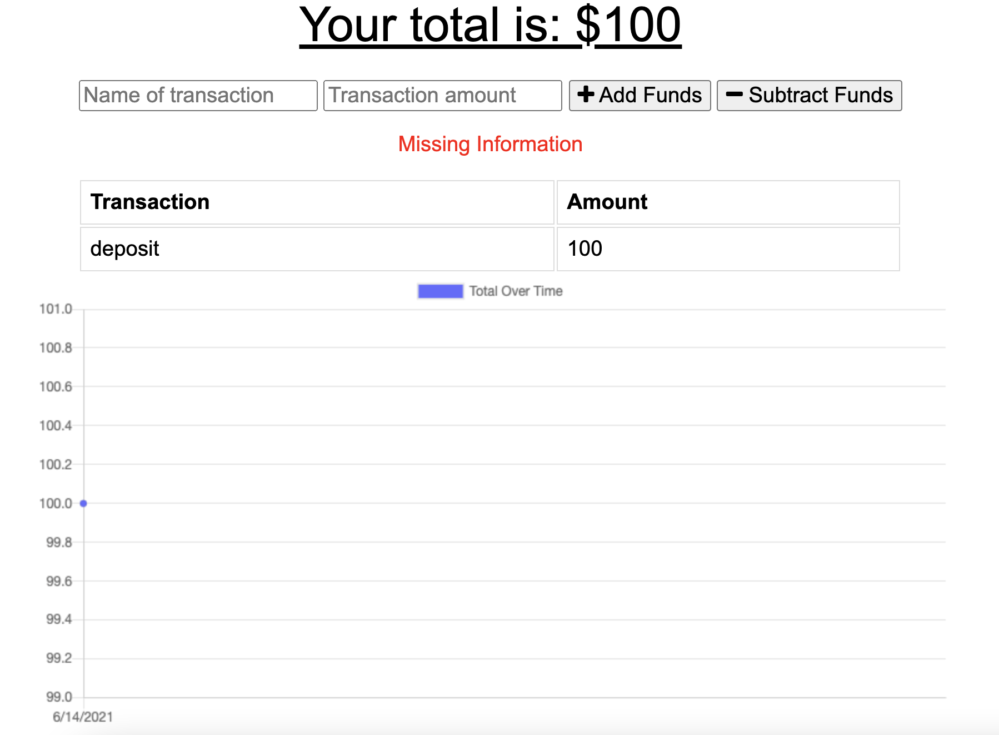

# Online-Offline-Budget-Tracker

This app allows the user to ad expenes and deposits to their budget with or without a connection. When entering transactions offline, the amounts are populated when brought back online.

# Technologies used

- Mongo DB
- Node JS
- Heroku
- MongoDB Atlas
- HTML
- CSS
- Bootstrap

# Deployed links:

https://github.com/rayaalsaedi/online-offline-budget-tracker

# Preview of the app:

